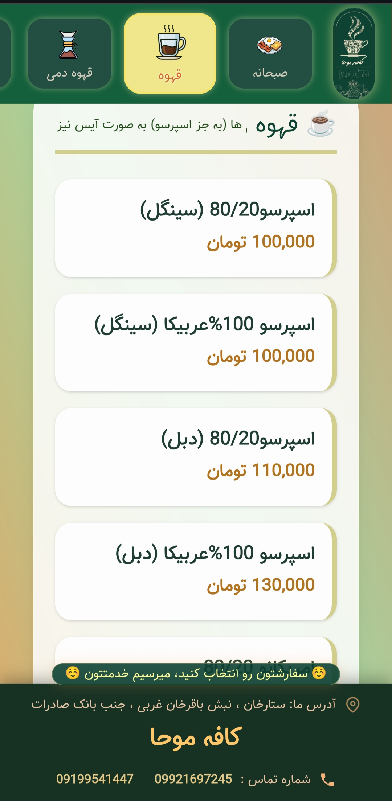

# ☕ Cafe Menu — Responsive Navigation Bar

A responsive navigation bar designed for a cafe website.

Optimized for most **mobile**, **tablet** to **desktop** — built with **Tailwind CSS** and a little **JavaScript** for interactivity.

🔗 **Live Demo**
https://zahrazalife.github.io/Moha-Cafe-Menu/
---

## 📝 Description

This is a website project for a cafe brand in Tehran, Iran.

The project features a **scrolling menu at the top** on mobile devices, smooth transitions, and a clean, minimal design.

The focus is on the **mobile** experience, with a beautiful style and easy navigation.

---
## 📸 Preview

| Mobile | 
|--------|

  

---

## 🛠️ Technologies Used

- HTML5
- Tailwind CSS
- JavaScript (for interaction)
- Fully Responsive Design

---

## 🧩 Key Features

- 📱Horizontal scrolling menu on mobile
- 🎨 Tailwind style with soft colors
- ⚡ Light and fast
- 🔄 Smooth state transition with JS

---

## 👩‍💻 Developer

**Zahra Zali** — Young Frontend Developer

GitHub: [https://github.com/ZahraZaliFE]

---

## ⭐ Support
If you liked this project, please give it a ⭐ star and share it! 😊

---

**Built with ☕ + Tailwind CSS**
